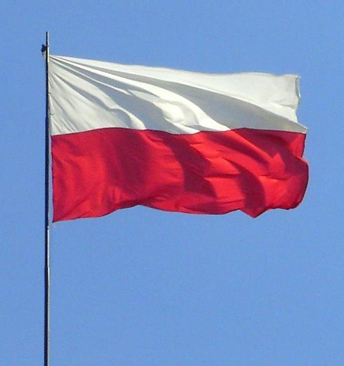

# Poland Warehouse (2018)

Image by (Wikipedia.org) (CC)

## About

665,210 sq ft logistics and production facility in Poland

# Roles

I was junior engineer on this project. Main role was to support Infrastructure Lead engineer in design and delivery of both sites. 

# Difficulties

- Language barrier

# Achievements

[Home](../index.md)
