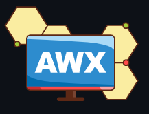

# AWX

Image by (https://www.ansible.com) (C)

## About

AWX was brought in to make managing THG infrastructure using Ansible easier and as a replacement for another configuration management software.

# Roles

My role in this project was to assist the lead engineer in documentation and assist in getting infrastrucrue ready for testing and deployment.

One of my main tasks was to create some infrastructure with [Terraform](https://github.com/0lzi/terraform) on Openstack and to use github actions workflows to create the environment in both live and staging.

I created infrastucture and deployed a selfhosted github runner for all the workflows to run on.

# Difficulties

At this time i had never used Terraform or github actions so having to learn two different technologies at the same time to complete the tasks.

# Achievements

Successfully delivered the staging and live environments for the solutions team that can be managed with gitOps

[Home](../index.md)
